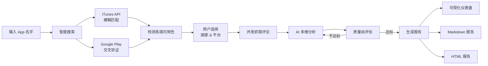
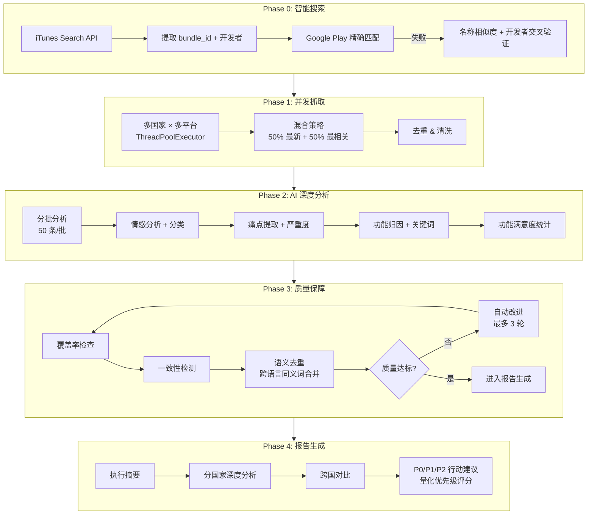
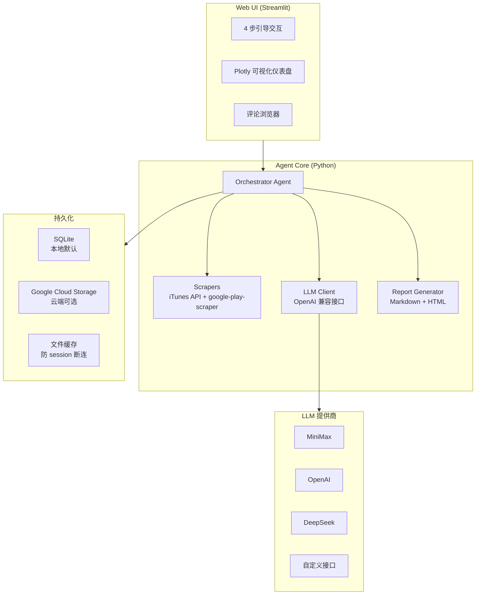

# AppPulse

> 感知每一条用户心声

输入 App 名字，自动抓取全球 App Store & Google Play 用户评论，AI 多维度深度分析，生成可视化仪表盘 + 专业洞察报告。

## 为什么需要 AppPulse？

- 产品经理想快速了解竞品的用户痛点，但手动翻评论太慢
- 出海团队需要同时分析多个国家的用户反馈，语言不通是障碍
- 版本发布后想第一时间掌握用户情绪变化，但缺乏系统化工具
- 老板要一份"用户怎么说"的报告，你需要数据支撑而不是拍脑袋

AppPulse 把这些事情自动化了：**一个名字进去，一份专业报告出来**。

## 核心亮点

| 亮点 | 说明 |
|------|------|
| 双平台全球覆盖 | App Store + Google Play，10+ 国家/地区并发抓取 |
| 智能搜索匹配 | 输入"ins"也能找到 Instagram，跨平台交叉验证防止错误关联 |
| 多维度 AI 分析 | 情感分析、痛点提取、功能归因、关键词去重、评分一致性检测 |
| 自我质量评估 | Agent 自动评估分析质量，不达标则自动改进（最多 3 轮） |
| 量化行动建议 | P0/P1/P2 三级优先级，每条建议带影响面×严重度×可解决性评分 |
| 可视化仪表盘 | 6 种图表 + 评论浏览器 + 多国家 Tab 切换 |
| 多格式导出 | Markdown / HTML / CSV 一键下载 |
| 灵活 LLM 接入 | 支持 MiniMax、OpenAI、DeepSeek 等任何 OpenAI 兼容接口 |

## 产品业务流



## Agent 工作流程



## 技术架构



## 快速开始

### 1. 安装

```bash
git clone https://github.com/TF-Wilbur/Review-Radar.git
cd Review-Radar
pip install -e ".[web,dev]"
```

### 2. 配置

```bash
cp .env.example .env
# 编辑 .env，填入你的 LLM API Key
```

| 变量 | 说明 | 默认值 |
|------|------|--------|
| `LLM_API_KEY` | LLM API 密钥 | — |
| `LLM_BASE_URL` | OpenAI 兼容接口地址 | `https://api.minimax.chat/v1` |
| `LLM_MODEL` | 模型名称 | `MiniMax-M2.7` |

### 3. 启动 Web UI（推荐）

```bash
streamlit run web/app.py
```

浏览器打开 `http://localhost:8501`，按引导操作即可。

### 4. 命令行使用

```bash
# 基础用法
apppulse "TikTok"

# 多国家 + 指定平台
apppulse "微信" --countries us,cn,jp --platforms app_store,google_play --count 200
```

| 参数 | 说明 | 默认值 |
|------|------|--------|
| `app_name` | App 名字 | — |
| `--count` | 每平台每国家评论数 | 100 |
| `--countries` | 国家代码，逗号分隔 | `us` |
| `--platforms` | 平台，逗号分隔 | `app_store,google_play` |
| `--output` | 报告输出目录 | `reports` |

### 5. Docker / Cloud Run

```bash
# Docker
docker build -t apppulse .
docker run -p 8080:8080 --env-file .env apppulse

# Cloud Run
gcloud run deploy apppulse \
  --source . \
  --region asia-east1 \
  --allow-unauthenticated \
  --timeout 600 \
  --set-env-vars "LLM_API_KEY=your-key,LLM_BASE_URL=https://api.minimax.chat/v1,LLM_MODEL=MiniMax-M2.7"
```

## 项目结构

```
review-radar/
├── review_radar/
│   ├── agent.py        # Agent 主循环（Orchestrator 模式）
│   ├── tool_impl.py    # Tool 实现（抓取、分析、评估、报告）
│   ├── scrapers.py     # App Store + Google Play 抓取 + 搜索验证
│   ├── prompts.py      # 所有 Prompt 模板
│   ├── llm.py          # LLM 客户端封装
│   ├── providers.py    # 多 LLM 提供商支持
│   ├── models.py       # 数据模型
│   ├── availability.py # 国家可用性检测
│   ├── history.py      # 分析历史（SQLite / GCS 双后端）
│   ├── config.py       # 配置常量
│   ├── report.py       # 报告保存 + HTML 导出
│   └── cli.py          # CLI 入口 + Rich 终端 UI
├── web/
│   └── app.py          # Streamlit Web UI
├── examples/           # 示例报告
├── tests/              # 测试
├── .streamlit/         # Streamlit 配置
├── Dockerfile
├── pyproject.toml
└── .env.example
```

---

## 示例报告：Instagram 用户评论洞察

> 以下是 AppPulse 对 Instagram 的真实分析报告，展示完整的输出效果。

### 📋 执行摘要

本次分析基于 **220 条**用户评论，覆盖美国 iOS 与 Android 双平台。整体情感分布呈现明显负面倾向：负面评论 **64.3%**（9条）占比最高，正面仅 **7.1%**（1条），中性 **28.6%**（4条）。

**三大核心痛点：**

1. **Feed 排序机制**——"chronological order"提及 3 次，用户强烈要求恢复时间顺序排列
2. **账号安全问题**——误判封禁、申诉无响应，最长等待 5 个月无果
3. **应用稳定性**——"crashing"出现 3 次，Stories 功能崩溃问题突出

### 1. 总览

#### 1.1 数据概览

| 国家 | 评论数 | 正面率 | 负面率 | Top 1 痛点 |
|------|--------|--------|--------|------------|
| 🇺🇸 美国 | 14 | 7.1% | 64.3% | Feed 不按时间顺序 / 应用崩溃 |

#### 1.2 情感与分类分布

| 情感类型 | 评论数量 | 占比 |
|---------|---------|------|
| 负面 | 9 | 64.3% |
| 中性 | 4 | 28.6% |
| 正面 | 1 | 7.1% |

| 分类 | 数量 | 占比 |
|-----|------|------|
| 功能吐槽 | 8 | 57.1% |
| 需求建议 | 3 | 21.4% |
| 其他/体验赞美/竞品对比 | 各1 | 各7.1% |

#### 1.3 高 Severity 痛点排名

| 排名 | 痛点描述 | 核心诉求 |
|-----|---------|---------|
| 1 | 账号被误判违规并终止、疑似被黑客入侵、客服不回应 | 账号安全与申诉机制 |
| 2 | 举报NSFW内容无效反被封号、等待恢复5个月无果 | 内容审核公平性 |
| 3 | 广告过多（每5帖一个）、Feed不按时间顺序 | 广告控制与排序选择权 |
| 4 | 算法改动导致大账号主导Feed、普通用户内容被淹没 | 内容分发公平性 |
| 5 | 音乐功能在商业账号不可用、故事功能崩溃、客服响应差 | 功能完整性与客服效率 |

### 2. 🇺🇸 美国市场分析

#### 2.1 关键词分析

| 关键词 | 频次 | 情感倾向 | 关联痛点 |
|-------|------|---------|---------|
| chronological order | 3 | 负面 | Feed排序功能缺失 |
| too many ads | 2 | 负面 | 广告体验 |
| unnecessary updates | 2 | 负面 | 产品迭代策略 |
| crashing | 3 | 负面 | 应用稳定性 |
| customer service | 2 | 负面 | 客服响应 |
| account terminated | 1 | 负面 | 账号封禁 |
| false violation | 1 | 负面 | 内容审核误判 |

#### 2.2 评分分布

| 星级 | 数量 | 占比 |
|-----|------|------|
| ★5 | 5 | 35.7% |
| ★4 | 3 | 21.4% |
| ★3 | 5 | 35.7% |
| ★2 | 1 | 7.1% |
| ★1 | 0 | 0% |

> 评分呈现"两极分化"特征：★5与★3合计占比71.4%。★1评分为0但负面情感高达64.3%，暗示用户仍有留存意愿，是产品改进的黄金窗口期。

#### 2.3 代表性评论

> "I have 3 accounts, I took a break for about a month. Finally get instagram back, try to log in, & it" —— v421.1.0, 2026-03-20

**解读：** 账号长期封禁后恢复困难，反映出"账号健康度"机制对间歇性用户的误伤问题。

> "Fix your ai bro i keep getting suspended for no reason I didn't do anything" —— v421.1.0, 2026-03-20

**解读：** 用户对产品有情感认同，但仍需通过差评方式引起官方注意，说明现有反馈渠道未能有效触达用户。

> "Helping me connect with my lovely fashionista's thank you for the platform as a designer, an artist!" —— v421.1.0, 2026-03-20

**解读：** 创作者群体对平台价值仍持认可态度，是平台的坚定支持者，但也是最可能因算法改动而流失的高风险群体。

### 3. 行动建议

#### P0 紧急修复（1-2周）

**建议 1：修复 Stories 功能崩溃问题** — 优先级评分：100（4×5×5）

| 维度 | 评分 | 说明 |
|------|------|------|
| 影响面 | 4 | Stories 为核心功能，受影响用户基数大 |
| 严重程度 | 5 | 崩溃直接阻断内容创作 |
| 可解决性 | 5 | 崩溃问题有明确堆栈信息可快速定位 |

执行动作：
1. 调取 Crashlytics 近30天 Stories 模块崩溃率，按设备型号/OS版本拆分
2. 重点排查版本91.0的崩溃日志
3. 针对高频崩溃设备发布热修复补丁

**建议 2：建立账号误判违规快速申诉通道** — 优先级评分：45（3×5×3）

执行动作：
1. 在"账号受限"页面新增一键申诉按钮
2. 针对"误判违规"场景建立机器学习二次复核模型
3. 设置申诉响应 SLA：24小时内初步回复，7天内完成处理

#### P1 短期优化（1-3月）

**建议 3：恢复 Feed 时间排序选项** — 优先级评分：48（4×4×3）

执行动作：
1. 在 feed 右上角新增"最新动态"切换入口
2. 将排序选择权加入设置→内容偏好一级菜单
3. 对选择时间排序的用户，前3条动态减少广告插入频率

**建议 4：降低广告投放密度** — 优先级评分：60（4×3×5）

执行动作：
1. 将广告密度从5:1调整为7:1
2. 针对高活跃用户（使用时长>30分钟/天），降低广告权重
3. 在广告详情页增加"减少此类广告"反馈入口

**建议 5：提升客服响应速度** — 优先级评分：45（3×5×3）

执行动作：
1. 在"账号受限/被封"页面增加实时聊天入口
2. 配置专项客服团队，响应时间缩至4小时内
3. 设置 KPI：首次响应 <1小时，解决率 >80%

#### P2 长期规划（3-6月）

**建议 6：为商业账号解锁音乐贴纸功能** — 优先级评分：24（2×4×3）

执行动作：
1. 与版权方协商商业账号音乐贴纸扩展授权协议
2. 若谈判周期长，先推出商业账号专属音频库（CC0曲目）
3. 为使用音乐的商业内容增加曝光权重

### 4. 分析说明

| 项目 | 说明 |
|------|------|
| 数据来源 | iOS App Store / Android Google Play |
| 总评论数 | 220 条 |
| 有效分析样本 | 14 条（美国市场） |
| 分析方法 | 情感分析 + 痛点提取 + 关键词统计 |

**局限性：** 单一市场、样本量有限、缺乏跨平台对比。建议后续补充更多国家和 Android 数据。

---

## License

MIT
